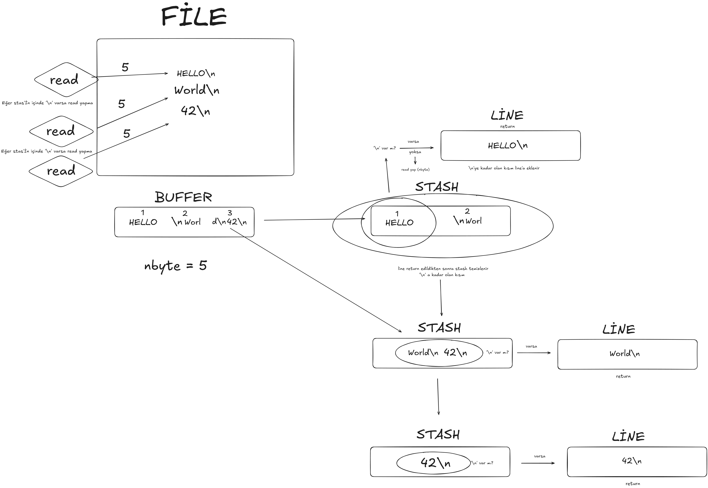

# get_next_line

Implementation of the 42 project `get_next_line`, developed by auzundag.

*This project has been created as part of the 42 curriculum at 42.*

---

## Description

`get_next_line` is a C function that reads from a file descriptor and returns the next line each time it is called.
It must:

- Work with any valid file descriptor (`fd`), including files and `stdin`.
- Read using a fixed-size buffer (`BUFFER_SIZE`) defined at compile time.
- Return a freshly allocated string containing one full line (ending in `\n` if present), or `NULL` on EOF or error.
- Preserve unread data between calls using a static buffer (the "stash").

This repository contains:

- Mandatory version:
  - `get_next_line.c`
  - `get_next_line.h`
  - `get_next_line_utils.c`
- Bonus version (multiple file descriptors in parallel):
  - `get_next_line_bonus.c`
  - `get_next_line_bonus.h`
  - `get_next_line_utils_bonus.c`


---

## Instructions

### Compilation (mandatory)

Example compilation for the mandatory part:

```sh
gcc -Wall -Wextra -Werror get_next_line.c get_next_line_utils.c -D BUFFER_SIZE=42 -o gnl_test
```

Then you can write your own `main.c`:

```c
#include "get_next_line.h"
#include <fcntl.h>
#include <stdio.h>

int main(void)
{
    int   fd = open("file.txt", O_RDONLY);
    char *line;

    if (fd < 0)
        return 1;
    while ((line = get_next_line(fd)) != NULL)
    {
        printf("%s", line);
        free(line);
    }
    close(fd);
    return 0;
}
```

Compile and run:

```sh
gcc -Wall -Wextra -Werror main.c get_next_line.c get_next_line_utils.c -D BUFFER_SIZE=42 -o gnl_test
./gnl_test
```

### Compilation (bonus)

For the bonus (handling multiple file descriptors concurrently):

```sh
gcc -Wall -Wextra -Werror get_next_line_bonus.c get_next_line_utils_bonus.c -D BUFFER_SIZE=42 -o gnl_bonus_test
```

Use exactly the same `get_next_line` API; internally, the bonus uses an array of stashes indexed by `fd`.

### Notes

- `BUFFER_SIZE` must be strictly positive; if `BUFFER_SIZE <= 0` or `fd` is invalid, `get_next_line` returns `NULL`.
- Every non-`NULL` line returned by `get_next_line` must be freed by the caller.
- The functions are written to respect 42’s Norminette style rules.


---

## Algorithm

### High‑level idea

Below is a visual overview of how the buffer, stash, and returned lines interact while reading from the file descriptor:



The core constraint is that we can only read fixed-size chunks (`BUFFER_SIZE` bytes) and we must still return whole logical lines (ending at `\n` or EOF).
To achieve this, we keep a static “stash” of data between calls:

- **Stash (mandatory):** `static char *stash;`
- **Stash (bonus):** `static char *stash[1024];` — one slot per `fd`.

On each call:

1. **Ensure stash exists**  
   If `stash` (or `stash[fd]`) is `NULL`, allocate an empty string with `ft_calloc(1, 1)`.

2. **Fill stash until we have a line or EOF**  
   `read_file_and_join` handles the loop:
   - While there is no `\n` in the stash and `read` still returns > 0:
     - Read up to `BUFFER_SIZE` bytes into a temporary `buffer`.
     - NUL-terminate `buffer`.
     - Concatenate `stash` and `buffer` into a new allocation with `ft_strjoin`.
     - Free the old stash and replace it with the new one.

3. **Extract one line from stash**  
   `line_handling`:
   - Scan the stash until `\n` or `\0`.
   - Allocate a `line` big enough for all those characters plus an optional `\n` and the final `\0`.
   - Copy characters up to (and including, if present) the first `\n`.
   - NUL-terminate `line`.

4. **Update or free stash after returning a line**  
   - If `line` is empty (`line[0] == '\0')`:
     - We reached EOF and there is no more content to return.
     - Free both `line` and `stash` via `free_stash(&stash)` and return `NULL`.
   - Otherwise:
     - `clean_stash` shifts the remaining part of stash (the bytes after the first returned line) to the front of the same allocation, and re‑terminates the string.
     - On the next call, the function will continue reading from this updated stash.

5. **Error handling**  
   - If `read` returns `-1`, we free the temporary buffer and return `NULL` (clearing the stash through `free_stash` in the caller).
   - If any `malloc`/`ft_calloc`/`ft_strjoin` fails, we similarly clean up the stash and return `NULL`.
   - The code is written so that failing allocations and failed `read` calls do not cause segmentation faults, which matches the “NULL_CHECK” strict tests.

### Why `read_file_and_join` takes a double pointer

Mandatory implementation:

```c
static char *read_file_and_join(char **stash, int fd)
```

Reason:

- Inside `read_file_and_join`, we repeatedly do:

  ```c
  new_stash = ft_strjoin(*stash, buffer);
  free(*stash);
  *stash = new_stash;
  ```

- That is, we:
  - Allocate a new concatenated buffer,
  - Free the old stash,
  - And update the caller’s stash pointer to the new address.

If `read_file_and_join` only took a single pointer by value (e.g. `char *stash`), and freed it internally, the caller would still hold a dangling pointer (pointing to freed memory). Using that stale pointer later (for example in `line_handling(stash)`) is undefined behavior and can cause segmentation faults — which is exactly the kind of bug that shows up in strict testers, especially on very small files like `1char.txt`.

By taking a `char **stash`:

- The helper function can safely:
  - Free the old allocation,
  - Replace it with the new one (`*stash = new_stash;`),
- And the caller (`get_next_line`) always sees the current, valid stash pointer.
- This pattern also mirrors the bonus version, where we pass `&stash[fd]` to the same kind of helper.

In short:  
Using a double pointer makes `read_file_and_join` responsible for keeping the stash pointer synchronized with its reallocations, and it completely removes the risk of the caller accidentally using a freed buffer.

### Complexity and justification

- Each byte read from the file is:
  - Read exactly once via `read`,
  - Copied a small, bounded number of times (during joins and stash cleanups).
- Total time complexity is `O(N)` in the total number of bytes read from the file.
- Memory usage is bounded by:
  - The size of the largest line seen so far,
  - Plus at most `BUFFER_SIZE` bytes of unread data.
- Using a static stash per `fd` is the simplest way to satisfy the requirement of:
  - Returning exactly one line per call,
  - Preserving data between calls without global state external to `get_next_line`,
  - Handling partial reads and arbitrary `BUFFER_SIZE`.

This algorithm is a standard, robust approach for `get_next_line` at 42: it balances simplicity, correctness, and compliance with the project’s constraints while handling edge cases like:

- Empty files,
- Files with a single character and no newline,
- Extremely long lines,
- Multiple descriptors in parallel (bonus),
- Read errors and allocation failures (strict tests).


---

## Resources

### Documentation and references

- `man 2 read` — POSIX `read` system call documentation.
- `man 2 open`, `man 2 close` — file descriptor operations.
- `man 3 malloc`, `man 3 free`, `man 3 calloc` — dynamic memory management.
- 42 subject PDF for `get_next_line` (official project specification).
- Francinette / fsoares `get_next_line` tester (for local testing and strict NULL/malloc checks).

### AI usage

I used GitHub Copilot (model GPT-5.1) as a helper during development in the following ways:

- Debugging strict tester failures:
  - I used it to reason about segmentation faults reported by the fsoares tester, especially for `1char.txt` and strict `NULL_CHECK` scenarios.
  - With its help I identified that using a freed stash pointer (when `read_file_and_join` only took `char *stash` and freed it internally) could cause undefined behavior.
- Refactoring helpers:
  - I asked for suggestions on changing `read_file_and_join` to take `char **stash` and update the pointer in-place, so the caller never keeps a dangling pointer.
  - I also used it to confirm the idea of adding an upper bound check on `fd` in the bonus implementation (`fd < 0 || fd >= 1024`) to protect the `stash[1024]` array from out-of-bounds access.
- Review and explanation:
  - I used it to review the overall control flow (`line_handling`, `clean_stash`, `free_stash`) and to help me structure and write the algorithm explanation in this README.

All final code decisions, adaptations to the 42 subject, and style/norminette compliance were made by me. I only used AI as a debugging and documentation aid, not as an automatic generator for the full project.
